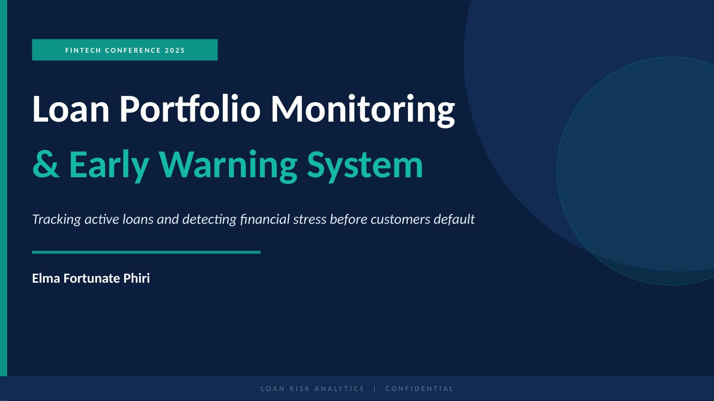
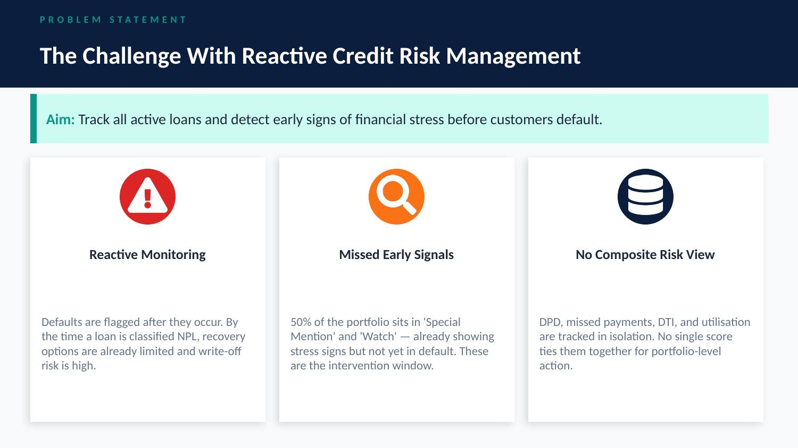
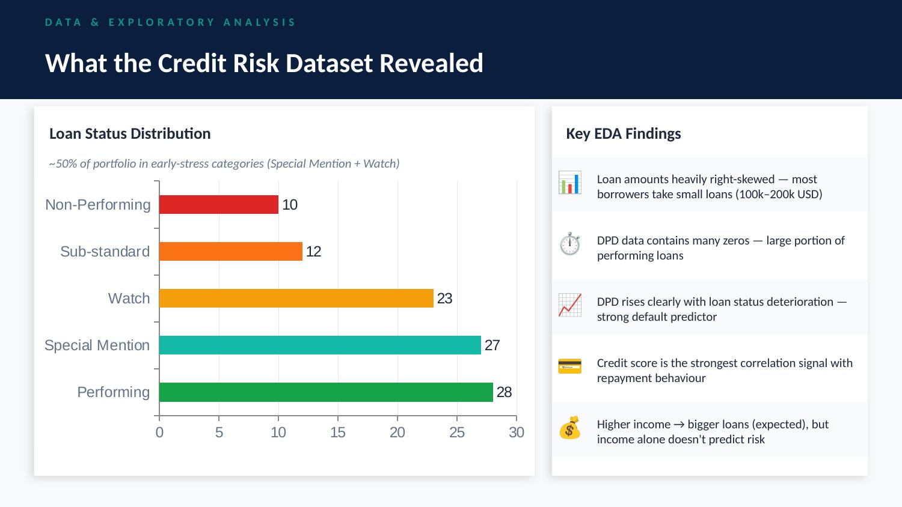
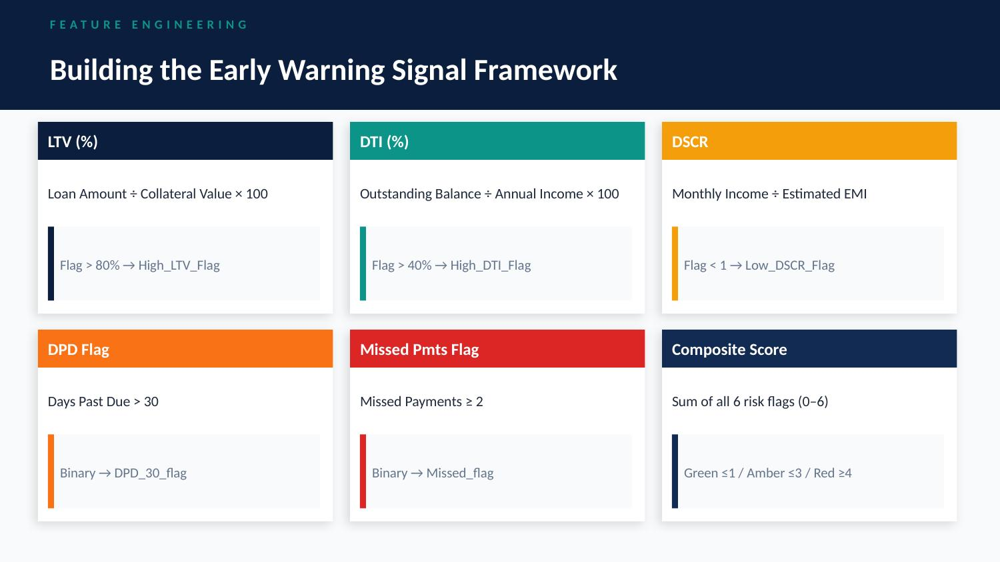
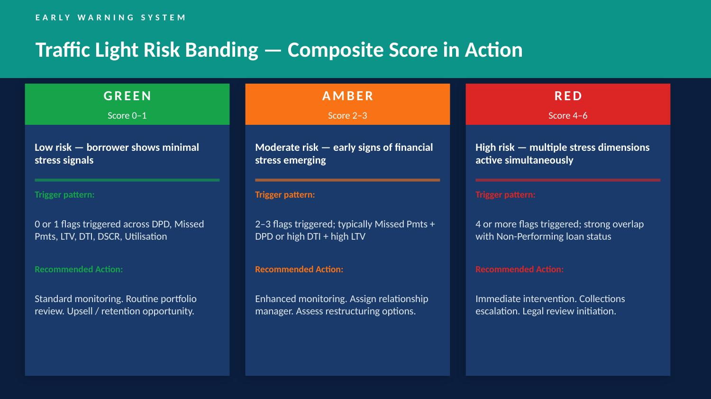
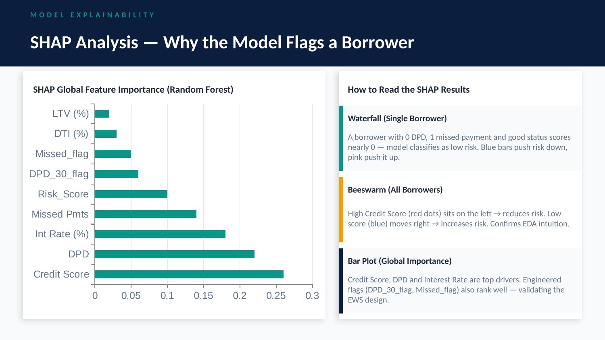
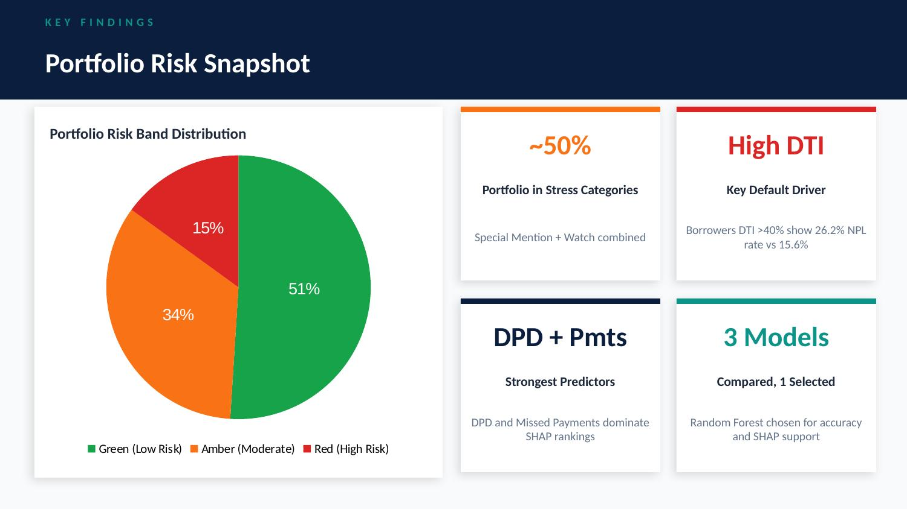
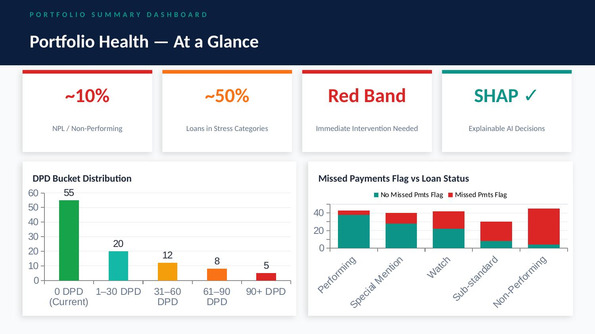

# 🏦 Loan Portfolio Monitoring & Early Warning System

> *Tracking active loans and detecting early signs of financial stress before customers default.*

**By Elma Fortunate Phiri**

---

## 📌 Project Overview

This project builds an end-to-end **Loan Portfolio Monitoring and Early Warning System (EWS)** using Python and machine learning. The system continuously monitors a loan portfolio, engineers risk signals from borrower and loan data, and flags at-risk customers before they reach default — enabling proactive intervention by credit teams.

### Objectives
- 🔍 Detect risky loans early using behavioural and financial signals
- 📊 Monitor portfolio health across key credit risk dimensions
- 🎯 Support data-driven decision-making on who to intervene on and when

---

## 🖼️ Project Slides

### Title


### The Problem


### Data & EDA


### Feature Engineering


### Early Warning System — Traffic Light Bands


### SHAP Model Explainability


### Key Findings


### Portfolio Summary Dashboard


---

## 🧰 Tech Stack

| Category | Tools |
|----------|-------|
| Language | Python 3 |
| Data Manipulation | pandas, numpy |
| Visualisation | matplotlib, seaborn |
| Profiling | ydata-profiling |
| Machine Learning | scikit-learn |
| Explainability | SHAP |
| Models Used | Logistic Regression, Decision Tree, Random Forest |
| Environment | Jupyter Notebook |

---

## ⚙️ Feature Engineering

Six risk flags were engineered from raw loan data and combined into a single composite score:

| Feature | Formula | Flag Threshold |
|---------|---------|----------------|
| **LTV (%)** | Loan Amount ÷ Collateral Value × 100 | > 80% → `High_LTV_Flag` |
| **DTI (%)** | Outstanding Balance ÷ Annual Income × 100 | > 40% → `High_DTI_Flag` |
| **DSCR** | Monthly Income ÷ Estimated EMI | < 1 → `Low_DSCR_Flag` |
| **DPD Flag** | Days Past Due > 30 | Binary → `DPD_30_flag` |
| **Missed Payments Flag** | Missed Payments ≥ 2 | Binary → `Missed_flag` |
| **Revolving Utilisation** | Revol Util > 70% | Binary → `High_Util_Flag` |

### Composite Risk Score & Traffic Light Bands
Risk_Score = DPD_30_flag + Missed_flag + High_LTV_Flag + High_DTI_Flag + Low_DSCR_Flag + High_Util_Flag
Score 0–1  →  🟢 GREEN  (Standard monitoring)
Score 2–3  →  🟡 AMBER  (Enhanced monitoring, restructuring review)
Score 4–6  →  🔴 RED    (Immediate intervention, collections escalation)

---

## 🤖 Model Building

Three classifiers were trained and compared:

| Model | Strengths | Limitation |
|-------|-----------|-----------|
| Logistic Regression | Interpretable, fast baseline | Assumes linear boundary |
| Decision Tree | Human-readable rules | Prone to overfitting |
| **Random Forest** ✅ | Best accuracy, robust, SHAP-compatible | Less interpretable (mitigated with SHAP) |

- **Target variable:** `Default_flag` (1 = Non-Performing, 0 = otherwise)
- **Split:** 80/20 train-test, stratified by target
- **Explainability:** SHAP TreeExplainer used for global feature importance, beeswarm, and single-borrower waterfall plots

### Top Predictors (SHAP)
1. Credit Score
2. Days Past Due (DPD)
3. Interest Rate (%)
4. Missed Payments
5. Composite Risk Score
6. Engineered flags (DPD_30_flag, Missed_flag)

---

## 📈 Key Findings

- **~50%** of the portfolio sits in Special Mention or Watch categories — already showing stress signals
- Borrowers with **DTI > 40%** have an NPL rate of **26.2%** vs 15.6% for lower DTI borrowers
- DPD and Missed Payments are the strongest behavioural predictors of default
- The composite EWS score successfully segments the portfolio into actionable risk tiers

---

## ⚠️ Known Limitations & Future Work

### Immediate Fixes
- [ ] Remove `Loan_Status_encoded` from features (data leakage risk)
- [ ] Retrain with SMOTE to address class imbalance (~10% default rate)
- [ ] Hyperparameter tuning via GridSearchCV

### Roadmap
- [ ] Automated weekly EWS report pipeline
- [ ] IFRS 9-aligned staging logic (Stage 1 / 2 / 3 mapping)
- [ ] Power BI or Streamlit dashboard deployment
- [ ] Real-time scoring API (REST endpoint)
- [ ] Model drift monitoring and quarterly retraining

---

## 🚀 How to Run

1. Clone the repository:
```bash
   git clone https://github.com/Elma-Fortunate/Loan-Portfolio-Monitoring-Early-Warning-System-ews.git
   cd loan-portfolio-ews
```

2. Install dependencies:
```bash
   pip install pandas numpy matplotlib seaborn scikit-learn shap ydata-profiling
```

3. Open the notebook:
```bash
   jupyter notebook LOAN_PORTFOLIO_MONITORING___EARLY_WARNING_SYSYTEM.ipynb
```

4. Update the dataset path in the data loading cell:
```python
   credit = pd.read_csv("path/to/Credit Risk.csv")
```

## 👩‍💻 Author

**Elma Fortunate Phiri**

---

## 📝 License

This project is for educational and portfolio purposes.
---

## 🗂️ Repository Structure
